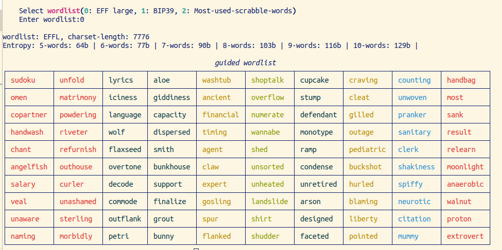

####  Guided wordlist for passphrases:
CAUTION: this is an unverified rookie software for illustration. Don't use for any real-life use cases.


example phrases:
- *agent smith designed most anaerobic ramp*
- *unwoven wolf handbag craving neurotic result*
- *ancient flaxseed blaming unsorted clerk timing*
- **Recommended entropy: greater than 100 bits for offline passphrases. Select more words or a bigger charset.** These passphrases above are only for illustration and don't have enough entropy for practical use in most offline cases.
- **Also, not recommended for any critical private key generation where collision can cause single point of failure**

---
#### Test:

```bash
git clone https://github.com/ns-xvrn/guided_passphrase.git &&
cd guided_passphrase &&
pip install -r requirements.txt &&
python3 src/main.py
```

----

#### Details:
- Motivation: create user selected high entropy passphrases
- Allowing users to pick words from the primary wordlist often results in risky less-random passphrases, hence presenting a user with a 10x10 grid of 100 words randomly chosen by the computer eliminates that issue, user then selects n words from those 100 words. This allows user to select slightly more personalized passphrases.
- This also avoids the machine knowing about your selected passphrase.


----
#### References:
- [Diceware](https://en.wikipedia.org/wiki/Diceware)
- Wordlists: [EFF](https://www.eff.org/deeplinks/2016/07/new-wordlists-random-passphrases) | [BIP39](https://github.com/bitcoin/bips/blob/master/bip-0039/english.txt) | [Peter Norvig's ngrams/sowpods](https://norvig.com/ngrams/)
- Paper: [Improving security and usability of passphrases with guided word choice](https://dl.acm.org/doi/abs/10.1145/3274694.3274734)